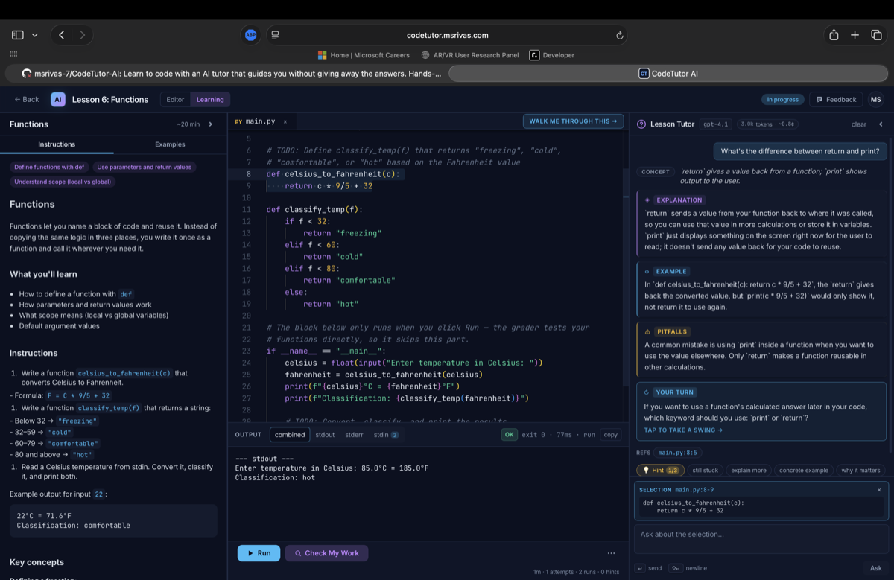

 

**Learn to code with an AI tutor that guides you — without giving away the answers.**
 
Write code, run it in a sandboxed environment, and get structured help when you're stuck.

 

### [Try it live → codetutor.msrivas.com](https://codetutor.msrivas.com)

 

 

[**Architecture**](docs/ARCHITECTURE.md) &nbsp;&bull;&nbsp; [**Development**](docs/DEVELOPMENT.md)

 

 

---

## Editor Mode

> A full coding workspace with 9 languages. Each language comes with a starter project so you can jump right in.

- **Write code** in a professional editor with syntax highlighting, autocomplete, and multi-file support
- **Run instantly** in a sandboxed container — see output, errors, and execution time
- **Ask the AI tutor** about your code — highlight a section and press `Cmd+K` to ask about it
- **Provide input** via a dedicated stdin tab, pre-filled with sample data for each language
- **First-time tour** walks you through the workspace on your first visit

## Guided Learning

> Two structured beginner courses: 12-lesson **Python Fundamentals** (through mini-project + two capstones) and 8-lesson **JavaScript Fundamentals** (through a habit-tracker mini-project). Instructions, starter code, and auto-validated exercises across both — powered by a shared content pipeline, per-language harness registry, and authoring scripts. _(More courses on the way.)_

- **Learn by doing** — read the instructions, write code, run it, and check your work
- **AI tutor that teaches, not solves** — knows your lesson context, gives escalating hints, and never spoils the answer
- **Instant feedback** — "Check My Work" validates your code and shows what to fix. Pass to see a recap and practice challenges
- **Example test cases** — capstone lessons expose visible example cases in an Examples tab. Run them any time to see how your function behaves before submitting; Check My Work also runs extra hidden cases
- **Practice mode** — 30+ bite-sized challenges (3 per lesson) reinforce concepts with a different twist. Optional, tracked separately, visible per-lesson on the course page
- **Progress that sticks** — your code, completions, and progress persist in the browser. Pick up where you left off — with a visible warning if your browser storage fills up so nothing is silently lost
- **Guided onboarding** — contextual nudges help you figure out what to do next. A spotlight tour introduces the workspace on your first lesson
- **Learning dashboard** — see your progress, what's next, recent activity, and which lessons might need review

## Shared Features

<table>
<tr>
<td width="50%">

**Adaptive AI tutor** — adjusts vocabulary and depth to your experience level (beginner, intermediate, advanced)

</td>
<td width="50%">

**Highlight + ask** — select code and press <code>Cmd+K</code> / <code>Ctrl+K</code> to ask about it

</td>
</tr>
<tr>
<td>

**Stuckness detection** — repeated failures unlock stronger hints and concrete next steps

</td>
<td>

**Bring your own key** — uses your OpenAI API key, never stored on any server. Editor and run work without one

</td>
</tr>
<tr>
<td>

**Light & dark themes** — follows your system by default, or pick one in Settings. Editor and app chrome switch together

</td>
<td>

**Accessible by default** — WCAG AA color contrast, keyboard-navigable splitters, full ARIA labeling on every interactive surface

</td>
</tr>
</table>

---

## Get Started

Head to **[codetutor.msrivas.com](https://codetutor.msrivas.com)** and sign in with Google or GitHub. The editor and run-code work right away; bring your own [OpenAI API key](https://platform.openai.com/api-keys) to unlock the AI tutor.

For development setup, architecture notes, and content authoring, see [docs/DEVELOPMENT.md](docs/DEVELOPMENT.md) and [docs/ARCHITECTURE.md](docs/ARCHITECTURE.md).

---

Copyright &copy; 2026 Mehul Srivastava. All rights reserved. Source available for personal viewing and learning. See <a href="LICENSE">LICENSE</a>.

