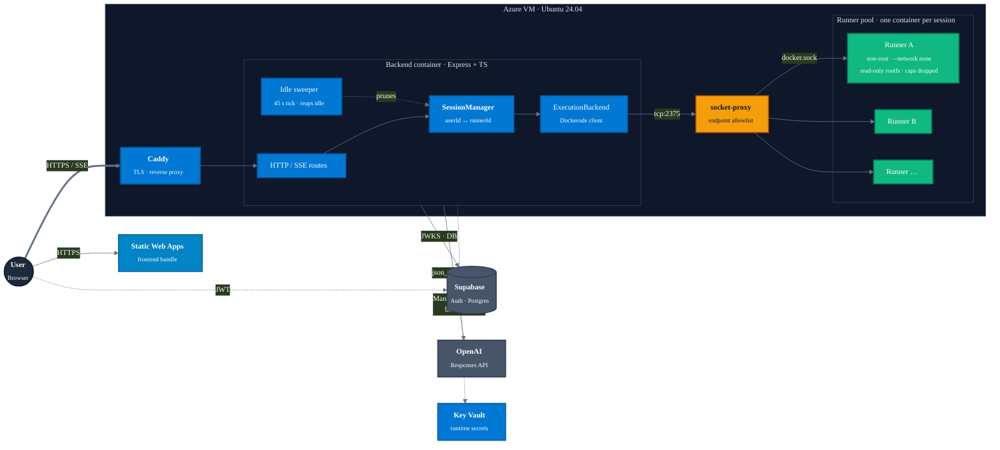
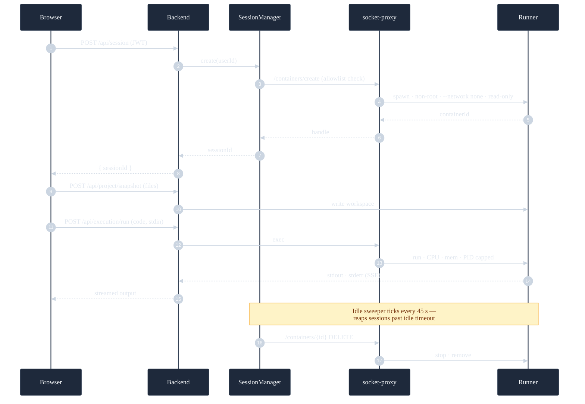

### [Try it live → codetutor.msrivas.com](https://codetutor.msrivas.com)

[**Architecture**](docs/ARCHITECTURE.md) &nbsp;&bull;&nbsp; [**Development**](docs/DEVELOPMENT.md) &nbsp;&bull;&nbsp; [**Content authoring**](docs/CONTENT_AUTHORING.md)

---

## Why CodeTutor AI

Most coding assistants solve the problem for you. **CodeTutor AI teaches you to solve it yourself** — the tutor knows your lesson, your current code, and how many times you've tried, and escalates hints accordingly. You write the answer; it makes sure you understand why.

  
   
  <b>Lesson workspace</b> — instructions, editor, and an AI tutor that guides without spoiling.

---

## Editor Mode

> A full coding workspace across nine languages. Each comes with a starter project so you can jump right in.

- **Professional editor** — syntax highlighting, autocomplete, multi-file projects, light + dark themes
- **Instant run** — sandboxed container returns stdout, stderr, and execution time
- **Highlight + ask** — select any code and press <kbd>Cmd</kbd>+<kbd>K</kbd> / <kbd>Ctrl</kbd>+<kbd>K</kbd> to ask the tutor about it
- **Dedicated stdin** — sample input pre-filled per language, or paste your own
- **First-time tour** — walks you through the workspace on your first visit

## Guided Learning

> Two structured beginner courses today: 12-lesson **Python Fundamentals** (through a mini-project + two capstones) and 8-lesson **JavaScript Fundamentals** (through a habit-tracker mini-project). Shared content pipeline, per-language test harness, and authoring scripts. _(More courses on the way.)_

- **Learn by doing** — read, write, run, check your work. Loop.
- **Tutor that teaches, not solves** — knows your lesson context, gives escalating hints, never spoils the answer
- **Instant validation** — "Check My Work" runs your code against the lesson's completion rules and shows what to fix
- **Visible + hidden tests** — capstone lessons show example test cases you can run any time; "Check My Work" also runs hidden cases
- **Practice mode** — 30+ bite-sized challenges (3 per lesson) reinforce each concept with a different twist
- **Progress that sticks** — code, completions, and progress save to your account and sync across devices
- **Guided onboarding** — contextual nudges and a spotlight tour introduce the workspace on your first lesson
- **Learning dashboard** — see what's next, recent activity, and lessons worth revisiting

## Shared features

<table>
<tr>
<td width="50%">

**Adaptive AI tutor** — adjusts vocabulary and depth to your experience level (beginner, intermediate, advanced).

</td>
<td width="50%">

**Highlight + ask** — select code and press <kbd>Cmd</kbd>+<kbd>K</kbd> / <kbd>Ctrl</kbd>+<kbd>K</kbd> to ask about it anywhere in the app.

</td>
</tr>
<tr>
<td>

**Stuckness detection** — repeated failures on the same step unlock stronger hints and concrete next steps.

</td>
<td>

**Tutor access** — signed-in learners get a small daily allowance on the hosted tier. Bring your own OpenAI key for unlimited use — encrypted at rest, never surfaced back. Editor and run always work without either.

</td>
</tr>
<tr>
<td>

**Light & dark themes** — follows your system by default, or pick one in Settings. Editor and app chrome switch together.

</td>
<td>

**Accessible by default** — WCAG AA contrast, keyboard-navigable splitters, full ARIA labeling on every interactive surface.

</td>
</tr>
</table>

## Under the hood

A full-stack TypeScript product shipping to real users at **[codetutor.msrivas.com](https://codetutor.msrivas.com)**.

<b>Session lifecycle — create → snapshot → run → reap</b>

 

| Layer | Stack |
| --- | --- |
| **Frontend** | React + Vite + Tailwind + Monaco + Zustand. React Router, SSE streaming, optimistic DB writes with server reconciliation. |
| **Backend** | Node + Express + TypeScript. Auth + Postgres via Supabase. OpenAI Responses API with strict `json_schema` + intent classifier (debug · concept · howto · walkthrough · checkin). |
| **Execution** | Per-session Docker runner container — non-root, `--network none`, read-only rootfs, CPU / memory / PID capped. Dockerode goes through a `socket-proxy` sidecar with an endpoint allowlist, not the raw socket. |
| **Content pipeline** | File-based courses with Zod schemas, a concept graph (used-before-taught detection), per-language function-test harness with HMAC-signed result envelopes, and golden-solution verification in CI. |
| **Infra** | Azure VM + Static Web Apps + Key Vault (managed-identity secret delivery); Caddy + Let's Encrypt TLS. GHCR images, OIDC deploys, Log Analytics + metric alerts + weekly VM backups. |
| **Tests** | Vitest (unit) + content validation + Playwright (end-to-end, real Docker stack). |

Full system design, security posture, and API surface: **[docs/ARCHITECTURE.md](docs/ARCHITECTURE.md)**.

---

## Get started

> [!TIP]
> **You don't need to install anything.** Click the live link, sign in, and you're coding in seconds — a small daily allowance of tutor questions is included.

### Try it live

Head to **[codetutor.msrivas.com](https://codetutor.msrivas.com)** and sign in with an email magic-link or Google OAuth. The editor and run-code work instantly; drop in your own [OpenAI API key](https://platform.openai.com/api-keys) for unlimited tutor use.

### Build it locally

Full dev setup (Docker Desktop + Supabase project credentials + frontend/backend install) is documented in **[docs/DEVELOPMENT.md](docs/DEVELOPMENT.md)**. Content authoring (lessons + practice exercises) is in **[docs/CONTENT_AUTHORING.md](docs/CONTENT_AUTHORING.md)**.

---

Copyright &copy; 2026 Mehul Srivastava. All rights reserved. Source available for personal viewing and learning. See <a href="LICENSE">LICENSE</a>.

